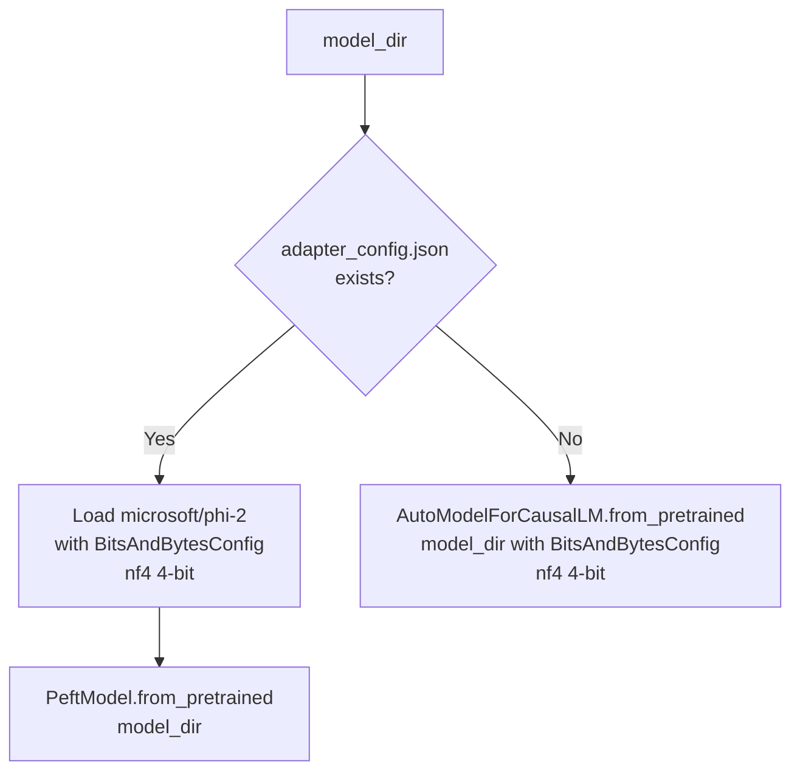
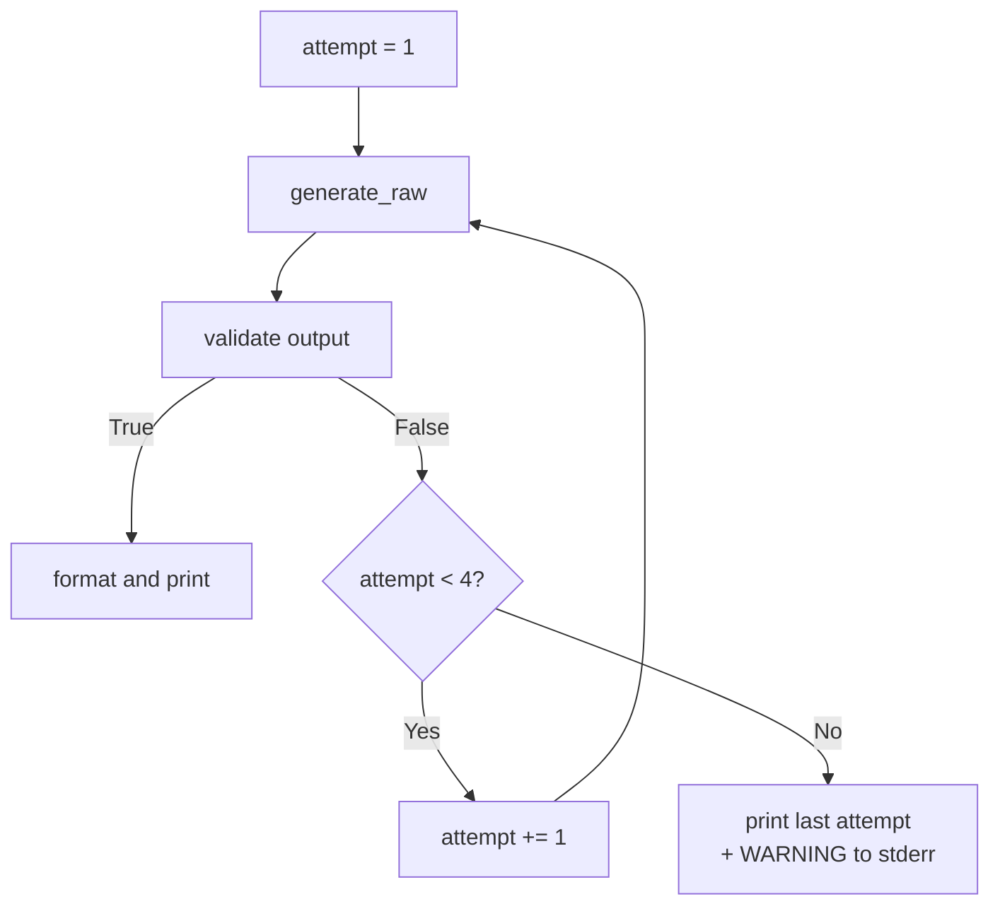

# Design Document — Pipeline Cleanup and Improvement

## Overview

This document describes the technical design for cleaning up and improving the fitness/motivation social media caption generation pipeline. The pipeline collects YouTube and Instagram data, preprocesses it into instruction-tuning JSONL format, fine-tunes Microsoft Phi-2 with QLoRA 4-bit quantization, and generates platform-formatted captions.

The changes address six gaps identified against the SRS:

1. Legacy scripts and data files pollute the working directory.
2. The YouTube Data API key is hardcoded in `config.py`.
3. The inference script (`generate_caption.py`) does not exist.
4. Platform-aware output formatting is unimplemented.
5. Output format validation is not enforced at inference time.
6. `combine.py` uses a hardcoded file list instead of glob discovery.

The design also adds per-record validation to `merge_datasets.py` and a comprehensive `README.md`.

---

## Architecture

The pipeline is a linear sequence of standalone Python scripts. Each script reads from files on disk and writes to files on disk, making the stages independently runnable and testable.

```mermaid
flowchart TD
    A[youtube_scraper.py\nYouTube Data API] -->|youtube_raw.csv| B[preprocess_youtube.py]
    C[insta-dataset/data-insta-*.json] -->|glob| D[combine_instagram.py]
    D -->|insta-dataset/combined_dataset.json| E[preprocess_instagram.py]
    B -->|youtube_processed.jsonl| F[merge_datasets.py]
    E -->|instagram_processed.jsonl| F
    F -->|train.jsonl + val.jsonl| G[finetune_phi2.py]
    G -->|phi2-caption-finetuned/ adapter| H[generate_caption.py]
    H -->|stdout caption| I[User]
    J[validate_output.py] -.->|validate\\(text\\) → bool| H
    K[config.py] -.->|get_api_key\\(\\)| A
```

**Data flow summary:**

| Stage | Script | Input | Output |
|---|---|---|---|
| Scrape | `youtube_scraper.py` | YouTube Data API | `youtube_raw.csv` |
| Combine | `combine_instagram.py` | `insta-dataset/data-insta-*.json` | `insta-dataset/combined_dataset.json` |
| Preprocess Instagram | `preprocess_instagram.py` | `insta-dataset/combined_dataset.json` | `instagram_processed.jsonl` |
| Preprocess YouTube | `preprocess_youtube.py` | `youtube_raw.csv` | `youtube_processed.jsonl` |
| Merge | `merge_datasets.py` | `youtube_processed.jsonl` + `instagram_processed.jsonl` | `train.jsonl` + `val.jsonl` |
| Fine-tune | `finetune_phi2.py` | `train.jsonl` + `val.jsonl` | `phi2-caption-finetuned/` |
| Generate | `generate_caption.py` | `phi2-caption-finetuned/` + `--prompt` | stdout |

---

## Components and Interfaces

### `config.py` (modified)

**Purpose:** Centralise scraper configuration. Provides a lazy accessor for the YouTube Data API key that reads from the environment at call time, never at import time.

**Key design decisions:**
- The module-level `API_KEY` constant is removed entirely.
- A `get_api_key()` function replaces it. This keeps the import side-effect-free and allows tests to set the environment variable before calling the function.
- `SEARCH_QUERIES` list is unchanged.

**Public interface:**

```python
def get_api_key() -> str:
    """Return the YouTube Data API key from the YOUTUBE_API_KEY environment variable.

    Raises:
        EnvironmentError: If the variable is unset, empty, or whitespace-only.
    """
```

**Behaviour:**
- Reads `os.environ.get("YOUTUBE_API_KEY", "")`.
- If the result is empty after `.strip()`, raises `EnvironmentError` with a message that names the variable and explains how to set it.
- Otherwise returns the raw string value (not stripped, preserving the caller's value exactly).

**`youtube_scraper.py` update:** Replace `from config import API_KEY` with `from config import get_api_key` and call `get_api_key()` at the point of use (inside `search_videos` and `get_video_description`).

---

### `combine_instagram.py` (new)

**Purpose:** Replace the hardcoded `combine.py`. Discovers all `insta-dataset/data-insta-*.json` files via glob, deduplicates records by the `id` field, and writes `insta-dataset/combined_dataset.json`.

**Public interface:**

```python
def find_source_files(base_dir: Path) -> list[Path]:
    """Return sorted list of paths matching data-insta-*.json in base_dir."""

def load_file(path: Path) -> list[dict]:
    """Load a single JSON file. Returns empty list and logs error on malformed JSON."""

def deduplicate(records: list[dict]) -> list[dict]:
    """Return records with duplicates removed, keeping first occurrence by 'id' field."""

def main() -> None:
    """Entry point. Exits non-zero if no source files are found."""
```

**Behaviour:**
- Uses `pathlib.Path.glob("data-insta-*.json")` — no hardcoded filenames.
- If `find_source_files` returns an empty list, prints an error to stderr and calls `sys.exit(1)`.
- Each file is loaded inside a `try/except json.JSONDecodeError` block; errors are logged to stderr and the file is skipped (processing continues).
- Deduplication iterates records in order, tracking seen `id` values in a `set`. Records without an `id` field are kept (they cannot be deduplicated).
- Writes the combined list as a JSON array to `insta-dataset/combined_dataset.json`.
- Prints a summary: files found, records loaded, duplicates removed, records written.

**CLI:**

```
python combine_instagram.py [--base-dir insta-dataset] [--output insta-dataset/combined_dataset.json]
```

---

### `merge_datasets.py` (modified)

**Purpose:** Merge, deduplicate, shuffle, and split JSONL datasets. The existing logic is preserved; per-record schema validation is added.

**New function:**

```python
def validate_record(
    record: dict,
    source_path: Path,
    line_number: int,
) -> bool:
    """Return True if record has all required keys with non-whitespace values.

    Logs a warning to stderr with source_path and line_number on failure.
    Required keys: 'instruction', 'input', 'output'.
    """
```

**Modified function — `load_jsonl`:**

The existing `load_jsonl` already handles `json.JSONDecodeError`. The loop body is extended to call `validate_record` after successful JSON parsing. Records that fail validation are skipped (not appended to `records`).

**Zero-valid-records edge case:**

After loading both files, if `len(combined) == 0`, `merge_datasets.py` logs a warning to stderr (`WARNING: No valid records found after filtering. Output files will be empty.`) and writes empty files before exiting with code 0 (the files are created, just empty — downstream tools can handle empty JSONL).

**Warning format:**

```
WARNING: Skipping record in <path> line <n>: missing key 'output'
WARNING: Skipping record in <path> line <n>: empty value for key 'instruction'
```

---

### `validate_output.py` (new)

**Purpose:** Standalone importable module that validates whether a generated caption meets the SRS output constraints (30–40 non-hashtag words, exactly 5 hashtags).

**Public interface:**

```python
def count_body_words(text: str) -> int:
    """Count whitespace-delimited tokens that do not begin with '#'."""

def count_hashtags(text: str) -> int:
    """Count whitespace-delimited tokens that begin with '#'."""

def validate(text: str) -> bool:
    """Return True iff body word count is in [30, 40] and hashtag count is exactly 5."""
```

**Design notes:**
- All three functions are pure (no I/O, no side effects).
- `count_body_words` and `count_hashtags` split on whitespace (`text.split()`), then filter by whether the token starts with `#`.
- `validate` is the conjunction: `30 <= count_body_words(text) <= 40 and count_hashtags(text) == 5`.
- The module has no `__main__` block; it is import-only.

---

### `generate_caption.py` (new)

**Purpose:** Load the fine-tuned Phi-2 model (LoRA adapter or merged) and generate a platform-formatted caption from a user prompt. Validates output and retries up to 4 times total.

**CLI:**

```
python generate_caption.py \
    --prompt "Push through the pain" \
    --model-dir ./phi2-caption-finetuned \
    --platform instagram
```

**Arguments:**

| Argument | Type | Default | Description |
|---|---|---|---|
| `--prompt` | `str` | required | User prompt text |
| `--model-dir` | `Path` | required | Path to LoRA adapter or merged model directory |
| `--platform` | `str` | `instagram` | Target platform: `instagram` or `facebook` |

**Key functions:**

```python
def parse_args() -> argparse.Namespace:
    """Parse and validate CLI arguments. Exits non-zero on invalid platform or missing model-dir."""

def detect_model_type(model_dir: Path) -> Literal["lora", "merged"]:
    """Return 'lora' if adapter_config.json exists in model_dir, else 'merged'."""

def load_model_and_tokenizer(
    model_dir: Path,
) -> tuple[PreTrainedModel, PreTrainedTokenizer]:
    """Load model with 4-bit NF4 BitsAndBytesConfig.
    Uses PeftModel for LoRA, AutoModelForCausalLM for merged.
    Exits non-zero on failure.
    """

def build_prompt(user_prompt: str, platform: str) -> str:
    """Prepend platform-specific instruction prefix to the user prompt."""

def generate_raw(
    model: PreTrainedModel,
    tokenizer: PreTrainedTokenizer,
    prompt: str,
    max_new_tokens: int = 200,
) -> str:
    """Run model.generate and decode the output tokens."""

def format_caption(platform: str, caption_body: str, hashtag_block: str) -> str:
    """Format caption according to platform conventions.
    Instagram: caption_body + '\\n' + hashtag_block
    Facebook:  caption_body + '\\n\\n' + hashtag_block
    Falls back to single-space join on exception.
    """

def run_with_retry(
    model: PreTrainedModel,
    tokenizer: PreTrainedTokenizer,
    prompt: str,
    platform: str,
    max_attempts: int = 4,
) -> tuple[str, bool]:
    """Generate and validate up to max_attempts times.
    Returns (output_text, passed_validation).
    On exhaustion, returns last attempt with passed_validation=False.
    """

def main() -> None:
    """Entry point."""
```

**Output format (stdout):**

```
Instagram
Push through the pain every single day. Your body can handle more than your mind thinks...
#fitness #motivation #gym #discipline #grind
```

Line 1 is always the capitalised platform label (`Instagram` or `Facebook`). Lines 2+ are the formatted caption.

**Model loading logic:**



**Retry loop:**



---

### `validate_output.py` — standalone importability

The module exposes `validate`, `count_body_words`, and `count_hashtags` at the top level. `generate_caption.py` imports it as:

```python
from validate_output import validate
```

No circular imports exist because `validate_output.py` has no imports from the pipeline.

---

### `.env.example` (new)

```
# Copy this file to .env and fill in your real API key.
# Obtain a YouTube Data API key at https://console.developers.google.com/
YOUTUBE_API_KEY=your-api-key-here
```

### `.gitignore` (new or updated)

Must contain at minimum:

```
.env
*.env
__pycache__/
*.pyc
```

---

## Data Models

### JSONL Record (instruction-tuning format)

All records in `youtube_processed.jsonl`, `instagram_processed.jsonl`, `train.jsonl`, and `val.jsonl` conform to:

```json
{
  "instruction": "Write an engaging Instagram caption for a fitness and motivation post.",
  "input": "Keywords: fitness, motivation, gym",
  "output": "Push through the pain every single day..."
}
```

All three keys are required. Values must be non-empty strings after `.strip()`.

### Combined Instagram JSON

`insta-dataset/combined_dataset.json` is a JSON array of raw Instagram post objects. Each object may contain an `id` field used for deduplication. The schema is determined by the Apify scraper output and is not validated by `combine_instagram.py` beyond JSON parseability.

### Caption Output (stdout)

```
<Platform Label>\n
<caption body>\n
<hashtag block>
```

Where:
- `<Platform Label>` is `Instagram` or `Facebook`
- `<caption body>` is 30–40 non-hashtag words
- `<hashtag block>` is exactly 5 space-separated `#tag` tokens
- Instagram: one `\n` between body and hashtags
- Facebook: two `\n\n` between body and hashtags

---

## Correctness Properties

*A property is a characteristic or behavior that should hold true across all valid executions of a system — essentially, a formal statement about what the system should do. Properties serve as the bridge between human-readable specifications and machine-verifiable correctness guarantees.*

### Property 1: API key round-trip

*For any* non-empty, non-whitespace string `s`, if `YOUTUBE_API_KEY` is set to `s` in the environment, then `get_api_key()` shall return `s` unchanged.

**Validates: Requirements 2.1**

---

### Property 2: Whitespace API key raises EnvironmentError

*For any* string composed entirely of whitespace characters (spaces, tabs, newlines), setting `YOUTUBE_API_KEY` to that string and calling `get_api_key()` shall raise `EnvironmentError`.

**Validates: Requirements 2.4**

---

### Property 3: Output validator correctness

*For any* string `text`, `validate(text)` shall return `True` if and only if `count_body_words(text)` is in the closed interval `[30, 40]` and `count_hashtags(text)` equals exactly 5. For all other inputs, `validate(text)` shall return `False`.

**Validates: Requirements 4.1, 4.2, 4.3**

---

### Property 4: Instagram caption formatting

*For any* non-empty caption body string `body` and non-empty hashtag block string `tags`, `format_caption("instagram", body, tags)` shall return a string equal to `body + "\n" + tags`.

**Validates: Requirements 5.1**

---

### Property 5: Facebook caption formatting

*For any* non-empty caption body string `body` and non-empty hashtag block string `tags`, `format_caption("facebook", body, tags)` shall return a string equal to `body + "\n\n" + tags`.

**Validates: Requirements 5.2**

---

### Property 6: Platform label is always the first output line

*For any* valid platform value (`instagram` or `facebook`) and any generated caption, the first line of the complete stdout output shall be the capitalised platform label (`Instagram` or `Facebook`).

**Validates: Requirements 5.3**

---

### Property 7: Invalid platform causes non-zero exit

*For any* string that is neither `"instagram"` nor `"facebook"`, passing it as the `--platform` argument shall cause `generate_caption.py` to exit with a non-zero exit code and print an error message to stderr.

**Validates: Requirements 3.3, 5.4**

---

### Property 8: Model loader auto-detects LoRA vs merged

*For any* model directory path, if the directory contains a file named `adapter_config.json` then `detect_model_type` shall return `"lora"`; if the directory does not contain `adapter_config.json` then `detect_model_type` shall return `"merged"`.

**Validates: Requirements 3.8, 3.9**

---

### Property 9: Merger rejects all invalid records

*For any* JSONL dataset where a record is missing one or more of the keys `instruction`, `input`, `output`, or where any of those keys has an empty or whitespace-only value, `load_jsonl` (with validation) shall not include that record in its return value, and shall have logged a warning to stderr containing the source file path and the line number.

**Validates: Requirements 6.1, 6.2**

---

### Property 10: Deduplication by id preserves uniqueness

*For any* collection of Instagram JSON records (possibly containing duplicate `id` values), `deduplicate` shall return a list where each `id` value appears at most once, and the first occurrence of each `id` is the one retained.

**Validates: Requirements 7.2**

---

### Property 11: Error-tolerant file processing

*For any* mix of valid and malformed JSON files in the source directory, `combine_instagram.py` shall successfully process all valid files, include their records in the output, log an error to stderr for each malformed file, and exit with code 0 (provided at least one valid file exists).

**Validates: Requirements 7.4**

---

## Error Handling

### `config.py`

| Condition | Behaviour |
|---|---|
| `YOUTUBE_API_KEY` unset or empty | `EnvironmentError` with variable name and setup instructions |
| `YOUTUBE_API_KEY` whitespace-only | `EnvironmentError` with "value is present but invalid (whitespace-only)" message |

### `combine_instagram.py`

| Condition | Behaviour |
|---|---|
| No files match glob pattern | Print error to stderr, `sys.exit(1)` |
| File is malformed JSON | Print error with filename to stderr, skip file, continue |
| Output directory does not exist | `FileNotFoundError` propagates (caller must ensure `insta-dataset/` exists) |

### `merge_datasets.py`

| Condition | Behaviour |
|---|---|
| Input file not found | Print error to stderr, `sys.exit(1)` |
| Line is invalid JSON | Print warning with path + line number to stderr, skip line |
| Record missing required key | Print warning with path + line number to stderr, skip record |
| Record has empty/whitespace value | Print warning with path + line number to stderr, skip record |
| Zero valid records after filtering | Print warning to stderr, write empty output files, exit 0 |

### `validate_output.py`

No I/O — pure functions. No exceptions are raised for any string input (including empty string, which returns `False`).

### `generate_caption.py`

| Condition | Behaviour |
|---|---|
| `--model-dir` not provided or path does not exist | Print error to stderr, `sys.exit(1)` |
| `--platform` is unrecognised | Print error to stderr, `sys.exit(1)` |
| Model loading fails | Print exception to stderr, `sys.exit(1)` |
| All 4 generation attempts fail validation | Print last attempt to stdout, print `WARNING: output did not pass validation after 4 attempts` to stderr, exit 0 |
| `format_caption` raises an exception | Fall back to `body + " " + hashtag_block` (single space join) |

---

## Testing Strategy

### Dual testing approach

Unit tests cover specific examples, edge cases, and error conditions. Property-based tests verify universal properties across many generated inputs. Both are necessary: unit tests catch concrete bugs, property tests verify general correctness.

### Property-based testing library

Use **Hypothesis** (Python). Each property test is configured with `@settings(max_examples=100)`.

Tag format for each property test:

```python
@settings(max_examples=100)
@given(...)
def test_property_N_description():
    # Feature: pipeline-cleanup-and-improvement, Property N: <property_text>
    ...
```

### Property test implementations

**Property 1 — API key round-trip** (`test_config.py`)

```python
from hypothesis import given, settings
from hypothesis import strategies as st

@settings(max_examples=100)
@given(st.text(min_size=1).filter(lambda s: s.strip()))
def test_api_key_roundtrip(api_key):
    # Feature: pipeline-cleanup-and-improvement, Property 1: API key round-trip
    import os
    os.environ["YOUTUBE_API_KEY"] = api_key
    from config import get_api_key
    assert get_api_key() == api_key
```

**Property 2 — Whitespace API key raises** (`test_config.py`)

```python
@settings(max_examples=100)
@given(st.text(alphabet=" \t\n\r", min_size=1))
def test_whitespace_api_key_raises(whitespace_key):
    # Feature: pipeline-cleanup-and-improvement, Property 2: whitespace API key raises EnvironmentError
    import os
    os.environ["YOUTUBE_API_KEY"] = whitespace_key
    with pytest.raises(EnvironmentError):
        get_api_key()
```

**Property 3 — Output validator correctness** (`test_validate_output.py`)

```python
@settings(max_examples=100)
@given(st.lists(st.text(min_size=1).filter(lambda w: not w.startswith("#") and " " not in w)),
       st.lists(st.text(min_size=2).map(lambda w: "#" + w.lstrip("#"))))
def test_validator_correctness(body_words, hashtag_tokens):
    # Feature: pipeline-cleanup-and-improvement, Property 3: output validator correctness
    text = " ".join(body_words + hashtag_tokens)
    result = validate(text)
    expected = (30 <= len(body_words) <= 40) and (len(hashtag_tokens) == 5)
    assert result == expected
```

**Property 4 — Instagram formatting** (`test_generate_caption.py`)

```python
@settings(max_examples=100)
@given(st.text(min_size=1), st.text(min_size=1))
def test_instagram_format(body, tags):
    # Feature: pipeline-cleanup-and-improvement, Property 4: Instagram caption formatting
    result = format_caption("instagram", body, tags)
    assert result == body + "\n" + tags
```

**Property 5 — Facebook formatting** (`test_generate_caption.py`)

```python
@settings(max_examples=100)
@given(st.text(min_size=1), st.text(min_size=1))
def test_facebook_format(body, tags):
    # Feature: pipeline-cleanup-and-improvement, Property 5: Facebook caption formatting
    result = format_caption("facebook", body, tags)
    assert result == body + "\n\n" + tags
```

**Property 7 — Invalid platform exits non-zero** (`test_generate_caption.py`)

```python
@settings(max_examples=100)
@given(st.text().filter(lambda s: s not in ("instagram", "facebook")))
def test_invalid_platform_exits(platform_str):
    # Feature: pipeline-cleanup-and-improvement, Property 7: invalid platform causes non-zero exit
    result = subprocess.run(
        ["python", "generate_caption.py", "--prompt", "test", "--model-dir", ".", "--platform", platform_str],
        capture_output=True
    )
    assert result.returncode != 0
```

**Property 8 — Model loader auto-detect** (`test_generate_caption.py`)

```python
@settings(max_examples=100)
@given(st.booleans())
def test_model_type_detection(has_adapter_config):
    # Feature: pipeline-cleanup-and-improvement, Property 8: model loader auto-detects LoRA vs merged
    with tempfile.TemporaryDirectory() as tmpdir:
        model_dir = Path(tmpdir)
        if has_adapter_config:
            (model_dir / "adapter_config.json").write_text("{}")
        result = detect_model_type(model_dir)
        expected = "lora" if has_adapter_config else "merged"
        assert result == expected
```

**Property 9 — Merger rejects invalid records** (`test_merge_datasets.py`)

```python
@settings(max_examples=100)
@given(st.fixed_dictionaries({
    "instruction": st.one_of(st.just(""), st.just("   "), st.none()),
    "input": st.text(),
    "output": st.text(),
}))
def test_merger_rejects_invalid(record):
    # Feature: pipeline-cleanup-and-improvement, Property 9: merger rejects all invalid records
    # Write record to temp file, run validate_record, assert it returns False
    ...
```

**Property 10 — Deduplication by id** (`test_combine_instagram.py`)

```python
@settings(max_examples=100)
@given(st.lists(st.fixed_dictionaries({"id": st.integers(min_value=1, max_value=10), "data": st.text()})))
def test_deduplication_by_id(records):
    # Feature: pipeline-cleanup-and-improvement, Property 10: deduplication by id preserves uniqueness
    result = deduplicate(records)
    seen_ids = [r["id"] for r in result]
    assert len(seen_ids) == len(set(seen_ids))
```

**Property 11 — Error-tolerant file processing** (`test_combine_instagram.py`)

```python
@settings(max_examples=100)
@given(st.lists(st.booleans(), min_size=1))
def test_error_tolerant_processing(file_validity_flags):
    # Feature: pipeline-cleanup-and-improvement, Property 11: error-tolerant file processing
    # Create temp files: valid JSON arrays for True flags, malformed text for False flags
    # Run combine logic, assert valid files are included and malformed files are skipped
    ...
```

### Unit tests (example-based)

| Test file | Covers |
|---|---|
| `test_config.py` | Missing env var raises, empty string raises, module import does not raise |
| `test_validate_output.py` | Empty string returns False, exactly-valid input returns True, off-by-one word counts |
| `test_combine_instagram.py` | No files found exits non-zero, single valid file produces output |
| `test_merge_datasets.py` | Zero valid records produces empty output files with warning |
| `test_generate_caption.py` | Missing --model-dir exits non-zero, retry loop calls generator exactly 4 times on repeated failure |

### Integration tests

| Test | Covers |
|---|---|
| Run `combine_instagram.py` then `preprocess_instagram.py` | Requirements 7.3 — exit 0, non-empty output |
| Run full pipeline on sample data | End-to-end smoke test |

### What is not unit-tested

- Model loading with real GPU/VRAM (integration/manual)
- Generation latency under 5 seconds (manual benchmark)
- Fine-tuning correctness (integration)
